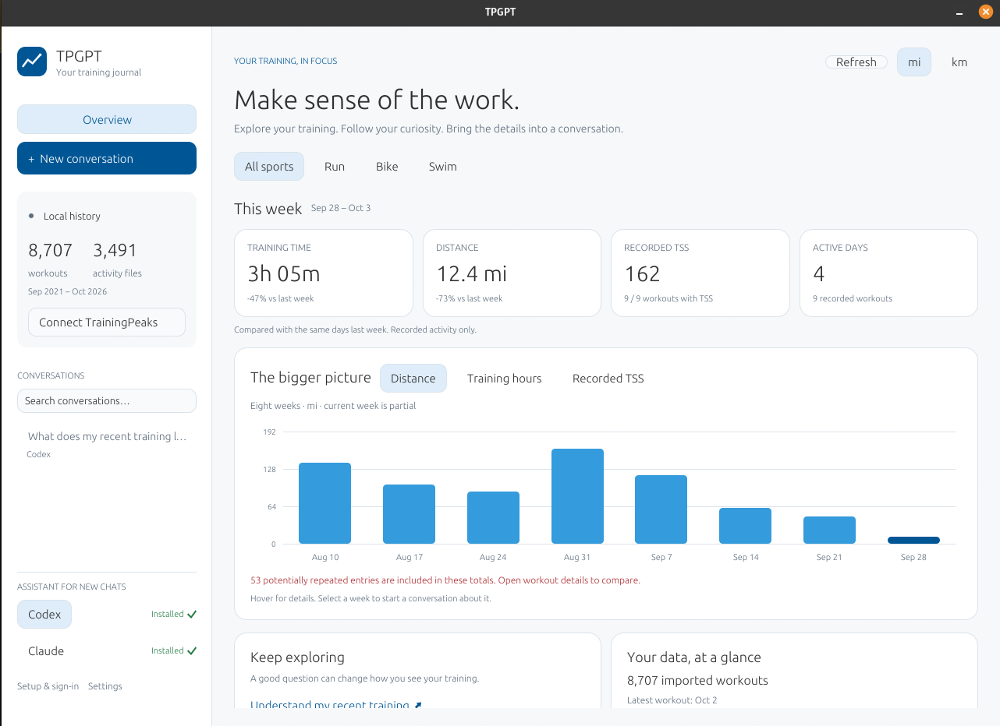
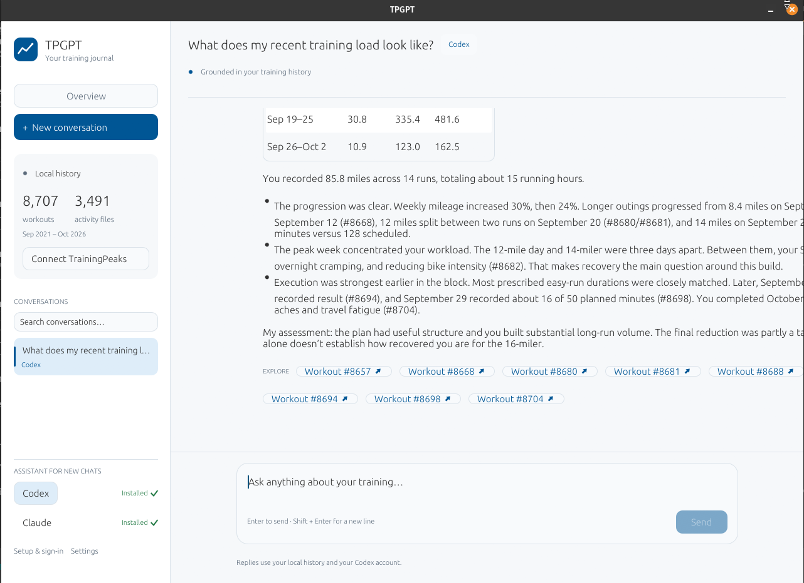

# TPGPT

A native Rust desktop app for chatting with your TrainingPeaks history through Codex or Claude Code.

Log in to TrainingPeaks, sync workouts and activity files into local SQLite, and ask about training volume, load, trends, or plans. Conversations are saved locally and resume the assistant's original CLI session.

The home screen brings your week into focus with time, distance, recorded TSS, active days, and an eight-week chart. Filter by sport, switch miles/kilometers, and explore recent workouts. Answers can include interactive charts and workout links that open local metrics, notes, activity graphs, and laps. Click a chart period to draft a follow-up question for review before sending. TrainingPeaks remains read-only: no workouts or calendar entries are uploaded, changed, or deleted.

## Screenshots

Explore your recent training from the overview.



Continue a conversation with your training history and open referenced workouts.



## Security and privacy

**TPGPT never sends your TrainingPeaks password or access token to an AI provider or a TPGPT server.** You enter your password in the TrainingPeaks login page; TPGPT does not collect or store it. The captured access token stays in memory and is used only for trusted TrainingPeaks HTTPS requests. It is never saved in SQLite, settings, or logs, or passed to the assistant CLI in its arguments or environment. Authentication and importing necessarily send credentials or the token to TrainingPeaks itself.

**Your imported training database, activity files, settings, saved plans, and app conversation history are stored locally on your computer.** TPGPT has no hosted backend and does not automatically upload your database. You can select an existing local database in **Settings**.

**Chat uses your chosen cloud assistant.** Codex or Claude sends your prompts and the training data it retrieves to answer your questions to OpenAI or Anthropic using your own account. That context leaves your computer when you chat; the app is not an offline AI service. Assistant authentication and its own session storage are managed by the CLI. Local storage does not mean that data shared with the assistant stays on your device.

TrainingPeaks access is limited to login and importing. Plans remain local; TPGPT never uploads, changes, or deletes workouts or calendar entries in TrainingPeaks. Credentials, medical records, training databases, and cached exports are excluded from the repository and release bundles. The two documentation screenshots above were explicitly selected for publication; other personal screenshots are excluded, and no screenshots are included in app bundles. See [the security checks](docs/SECURITY.md) for implementation and release safeguards.

## Download and install

Choose your operating system below to download TPGPT v0.1.2, or browse [GitHub Releases](https://github.com/KerryRitter/tpgpt/releases/latest).

| Platform | Bundle | Installation |
| --- | --- | --- |
| Ubuntu / Debian, x86_64<br>[Download installer](https://github.com/KerryRitter/tpgpt/releases/download/v0.1.2/tpgpt_0.1.2_amd64.deb) | `tpgpt_0.1.2_amd64.deb` | `sudo apt install ./tpgpt_0.1.2_amd64.deb` |
| Linux, x86_64<br>[Download app](https://github.com/KerryRitter/tpgpt/releases/download/v0.1.2/tpgpt-linux-x86_64.tar.gz) | `tpgpt-linux-x86_64.tar.gz` | Extract, install the runtime dependencies below, then run `./tpgpt` |
| Windows, x86_64<br>[Download app](https://github.com/KerryRitter/tpgpt/releases/download/v0.1.2/tpgpt-windows-x86_64.zip) | `tpgpt-windows-x86_64.zip` | Extract and open `TPGPT/tpgpt.exe` |
| macOS, Apple Silicon<br>[Download app](https://github.com/KerryRitter/tpgpt/releases/download/v0.1.2/tpgpt-macos-arm64.dmg) · [ZIP option](https://github.com/KerryRitter/tpgpt/releases/download/v0.1.2/tpgpt-macos-arm64.zip) | `tpgpt-macos-arm64.dmg` or `.zip` | Copy `TPGPT.app` into Applications |
| macOS, Intel<br>[Download app](https://github.com/KerryRitter/tpgpt/releases/download/v0.1.2/tpgpt-macos-x86_64.dmg) · [ZIP option](https://github.com/KerryRitter/tpgpt/releases/download/v0.1.2/tpgpt-macos-x86_64.zip) | `tpgpt-macos-x86_64.dmg` or `.zip` | Copy `TPGPT.app` into Applications |

Linux releases are built on Ubuntu 22.04. The archive requires GTK 3, WebKitGTK 4.1, EGL, OpenGL, and xkbcommon; on Ubuntu/Debian:

```bash
sudo apt install libgtk-3-0 libwebkit2gtk-4.1-0 libegl1 libgl1 libxkbcommon0
```

Windows needs the [Microsoft WebView2 Evergreen Runtime](https://developer.microsoft.com/en-us/microsoft-edge/webview2/#download-section), normally already present on Windows 10/11. macOS uses system WebKit. These releases have no developer code-signing certificate or Apple notarization; macOS offers an **Open Anyway** option in System Settings → Privacy & Security after an initial launch attempt. SHA-256 checksums are included with each release.

## Set up your assistant

Install and sign in to one of these external CLIs:

| Assistant | Install | Sign in |
| --- | --- | --- |
| Codex | [Official CLI setup](https://learn.chatgpt.com/docs/codex/cli) | `codex login` |
| Claude Code | [Official quickstart](https://code.claude.com/docs/en/quickstart) | Run `claude`; use `/login` to sign in again |

TPGPT checks both CLIs at startup. A green check means the executable runs; **Not installed** opens the installation docs. **Setup & sign-in** explains the remaining steps and lets you recheck. Select your assistant before starting a new conversation. Existing conversations keep their original assistant.

Open TPGPT, log in to TrainingPeaks in its login window, then select **Sync history**. The initial import covers five years in three-month windows and can resume after interruption. If athlete detection fails, enter your numeric athlete ID in **Settings**.

The desktop app is Rust with an egui chat interface and a Wry login webview. It has no JavaScript frontend or bundled Node runtime. A small embedded browser hook captures TrainingPeaks authorization headers. npm-installed assistant CLIs may require their own Node runtime.

TPGPT is an independent project and is not affiliated with TrainingPeaks, OpenAI, or Anthropic. TrainingPeaks login and export use its private API, which may change.

## Build from source

Install Rust 1.88+ and the platform prerequisites in [the native app guide](native/README.md).

```bash
cargo run --release --locked -p tpgpt
cargo test --release --locked
```

Build bundles with `./scripts/bundle-native.sh` on Linux/macOS or `./scripts/bundle-windows.ps1` on Windows. GitHub Actions builds on each platform, checks the source for private files and common credential formats, audits dependencies, runs unit tests and an MCP smoke check, and assembles releases from explicitly selected artifacts. Dependency license notices are included in every bundle. See [publication and security checks](docs/SECURITY.md) for scope and remaining upstream warnings.

The original [TypeScript export and MCP tools](docs/legacy-tools.md) are retained for development and command-line use. They are not bundled with the desktop app.
